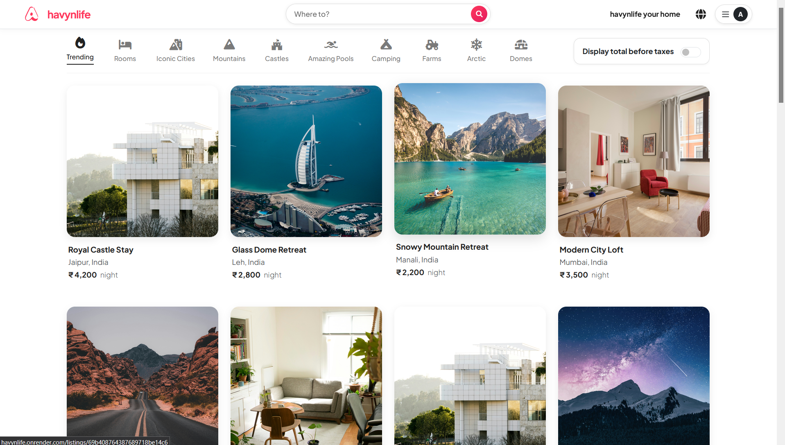
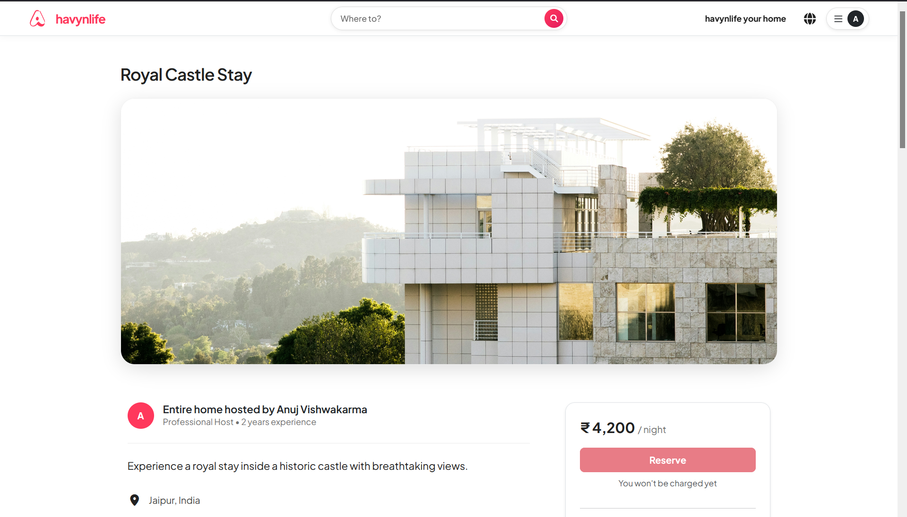
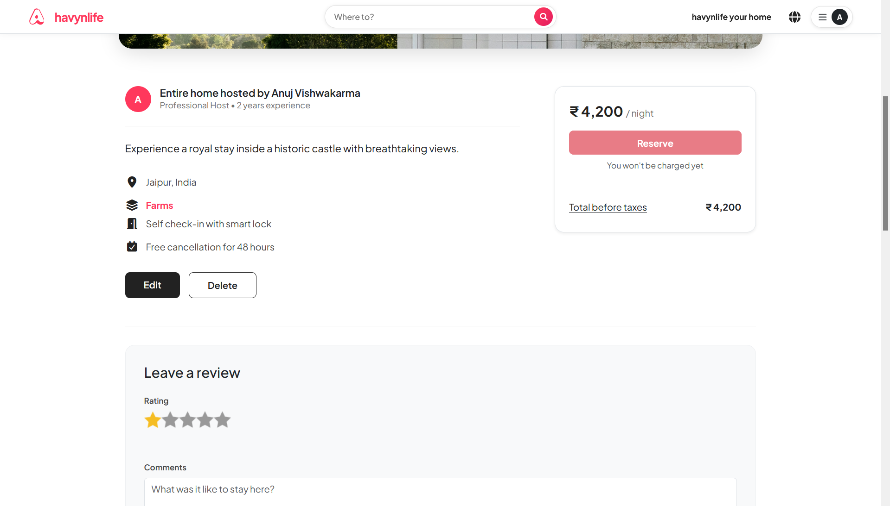
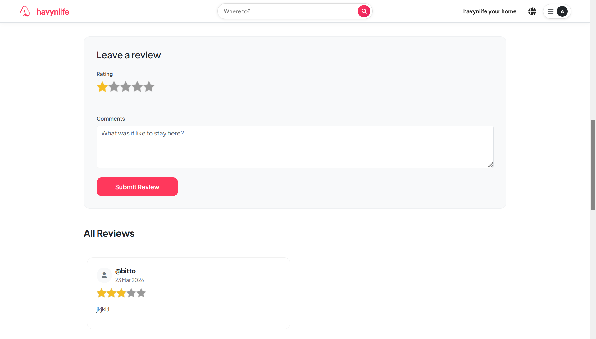
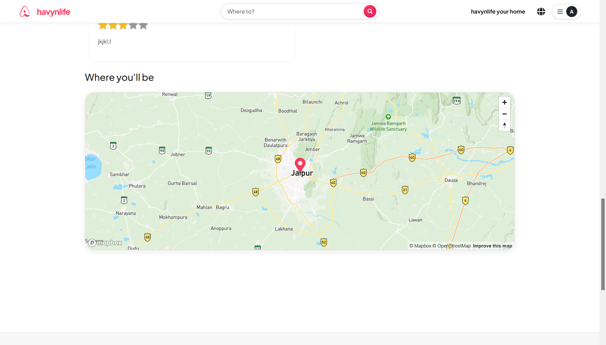
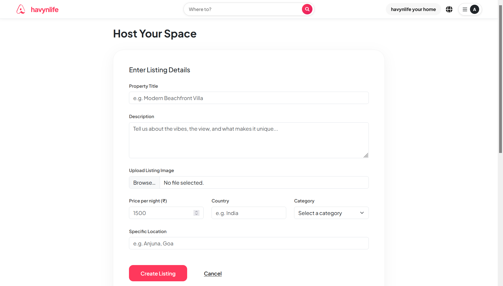
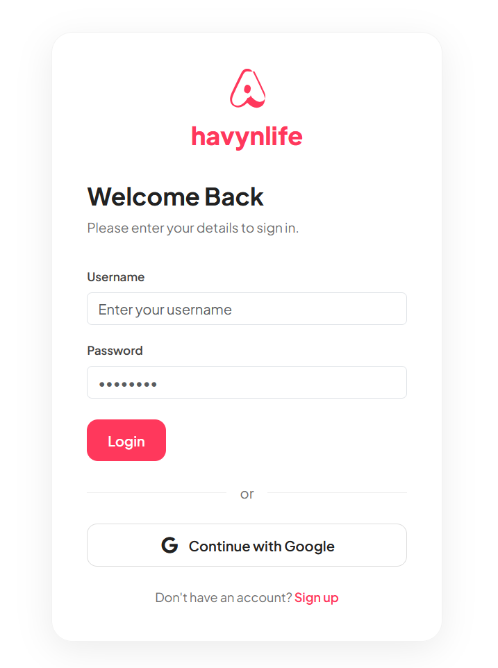

# havynlife 🏖️

> **A comprehensive, full-stack, Airbnb-inspired web application.**

**havynlife** is a fully functional web platform designed to emulate the core functionalities of Airbnb. It provides users with a seamless experience to discover, list, and review properties across various categories. Built with a robust Node.js and Express backend, coupled with EJS templating, this project demonstrates proficiency in backend architecture, database modeling, authentication, and third-party API integrations.

---

## 🎯 Purpose of the Project

The primary goal of **havynlife** is to build a robust, scalable, and user-friendly marketplace for property rentals. It was developed to:
- **Solve Real-World Problems:** Provide a platform where property owners can easily list their spaces, and travelers can find unique accommodations with ease.
- **Demonstrate Technical Proficiency:** Showcase advanced skills in full-stack web development, specifically using the MERN-inspired stack (MongoDB, Express, Node.js) with server-side rendering (EJS).
- **Implement Complex Features:** Handle complex logic such as secure user authentication, geospatial mapping, cloud image storage, and relational database modeling (connecting users, listings, and reviews).

---

## ⚙️ How It Works (Architecture & Data Flow)

The application follows the **MVC (Model-View-Controller)** architectural pattern:

1. **Client-Side (View)**: Users interact with a responsive UI built using **Bootstrap 5**, custom CSS, and EJS. The interface makes intuitive HTTP requests when a user browses properties, logs in, or submits a new listing.
2. **Server-Side (Controller)**: **Express.js** handles incoming routing. Controllers process these requests, utilizing **Passport.js** middleware to verify if the user is authenticated and authorized to perform specific actions (e.g., ensuring only the owner can edit their listing).
3. **Database (Model)**: **Mongoose** interacts with a **MongoDB** database. It retrieves or updates documents across three main collections:
   - `Users`: Stores user credentials, Google OAuth data, and profile info.
   - `Listings`: Stores property details, price, owner reference, and an array of associated review references.
   - `Reviews`: Stores star ratings, text comments, and the author reference.
4. **External API Integrations**:
   - **Cloudinary**: When a user creates or edits a listing, images are intercepted by **Multer**, uploaded to Cloudinary, and the returned secure URLs are saved in MongoDB.
   - **Mapbox GL JS**: Converts property locations into geographical coordinates and renders interactive map interfaces on the listing detail pages.

---

## 📸 Screenshots

### 1. Home Page & Listings
*Displays a beautiful grid of diverse properties with category filters (Trending, Rooms, Iconic Cities, Mountains, etc.).*
<p align="center">
  
</p>

### 2. Property Details (Top View)
*Detailed view showing the property title and an immersive hero image of the listing.*
<p align="center">
  
</p>

### 3. Property Details (Reserve Card)
*The lower section of the property page highlighting host information and a sticky reservation card.*
<p align="center">
  
</p>

### 4. User Reviews Section
*Interactive section allowing authenticated users to leave 1-5 star ratings and textual comments.*
<p align="center">
  
</p>

### 5. Interactive Map Integration
*A dynamic Mapbox map pinpointing the exact geographical location of the property.*
<p align="center">
  
</p>

### 6. Host Your Space (Create Listing)
*An intuitive, form-based interface allowing users to create new property listings with images and pricing.*
<p align="center">
  
</p>

### 7. User Authentication (Login)
*Secure login interface supporting both standard credentials and Google OAuth.*
<p align="center">
  
</p>

---

## ✨ Key Features

- **Property Listings**: Browse a diverse range of properties categorized by type. Users can view detailed property pages, add new listings, and manage their own properties (edit/delete).
- **Interactive Maps**: Integrated **Mapbox GL JS** to provide accurate, interactive maps.
- **Authentication & Authorization**: Secure user login and registration powered by **Passport.js**. Supports both Local (username/password) and **Google OAuth** strategies. Authorization middleware ensures data protection.
- **Reviews & Ratings**: An interactive review system allowing authenticated users to leave 1-5 star ratings and comments.
- **Image Uploads**: Seamless image uploads managed securely in the cloud using **Cloudinary**.
- **Responsive UI/UX**: A clean, modern interface built with **Bootstrap 5**, ensuring a premium experience across all devices.
- **Session Management**: Utilizes `express-session` backed by MongoDB for persistent sessions and `connect-flash` for user-friendly notifications.

---

## 🛠️ Tech Stack

### Frontend
- **HTML5 & CSS3** (Custom styling with *Plus Jakarta Sans* font)
- **EJS (Embedded JavaScript)** - Templating Engine
- **Bootstrap 5** - CSS Framework
- **Mapbox GL JS** - Interactive Maps API

### Backend
- **Node.js** - JavaScript Runtime
- **Express.js** - Web Framework
- **Passport.js** - Authentication 
- **Multer** - File Upload Middleware

### Database & Cloud
- **MongoDB** - NoSQL Database
- **Mongoose** - Object Data Modeling (ODM)
- **MongoStore** - Session storage
- **Cloudinary** - Cloud Image Storage API

---

## 🚀 Getting Started

Follow these instructions to get a copy of the project up and running on your local machine.

### Prerequisites

Ensure you have the following installed:
- [Node.js](https://nodejs.org/) (v18 or higher recommended)
- [MongoDB](https://www.mongodb.com/) (Local server or MongoDB Atlas cluster)
- API Keys for [Cloudinary](https://cloudinary.com/), [Mapbox](https://www.mapbox.com/), and [Google Cloud Console](https://console.cloud.google.com/).

### Installation

1. **Clone the repository:**
   ```bash
   git clone https://github.com/anujvishwakarma07/Airbnd.git
   cd Airbnd
   ```

2. **Install dependencies:**
   ```bash
   npm install
   ```

3. **Set up Environment Variables:**
   Create a `.env` file in the root directory and add the following:
   ```env
   NODE_ENV=development
   PORT=3000
   ATLASDB_URL=<your_mongodb_connection_string>
   SECRET=<your_session_secret_key>
   
   # Cloudinary Credentials
   CLOUD_NAME=<your_cloudinary_cloud_name>
   CLOUD_API_KEY=<your_cloudinary_api_key>
   CLOUD_API_SECRET=<your_cloudinary_api_secret>
   
   # Mapbox Token
   MAP_TOKEN=<your_mapbox_access_token>
   
   # Google OAuth Credentials (Optional)
   GOOGLE_CLIENT_ID=<your_google_oauth_client_id>
   GOOGLE_CLIENT_SECRET=<your_google_oauth_client_secret>
   ```

4. **Run the Application:**
   ```bash
   node app.js
   ```

5. **Open in Browser:**
   Navigate to `http://localhost:3000` to view the application.

---

## 📂 Project Structure

- `app.js` - Main application entry point and server configuration.
- `models/` - Mongoose schemas (Listing, Review, User).
- `routes/` - Express routers for modular route handling.
- `controllers/` - Logic for handling route requests (MVC pattern).
- `views/` - EJS templates for the frontend (`includes/`, `layouts/`).
- `public/` - Static assets (CSS, client-side JavaScript, icons).
- `utils/` - Utility classes and error handling.
- `init/` - Scripts to seed the database with initial sample data.

---

## 🤝 Contributing

Contributions, issues, and feature requests are welcome! 
Feel free to check the [issues page](https://github.com/anujvishwakarma07/Airbnd/issues).

## 📝 License

This project is licensed under the ISC License.

---
*Developed with ❤️ by [Anuj Vishwakarma](https://github.com/anujvishwakarma07)*